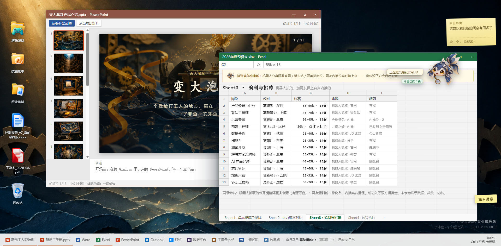
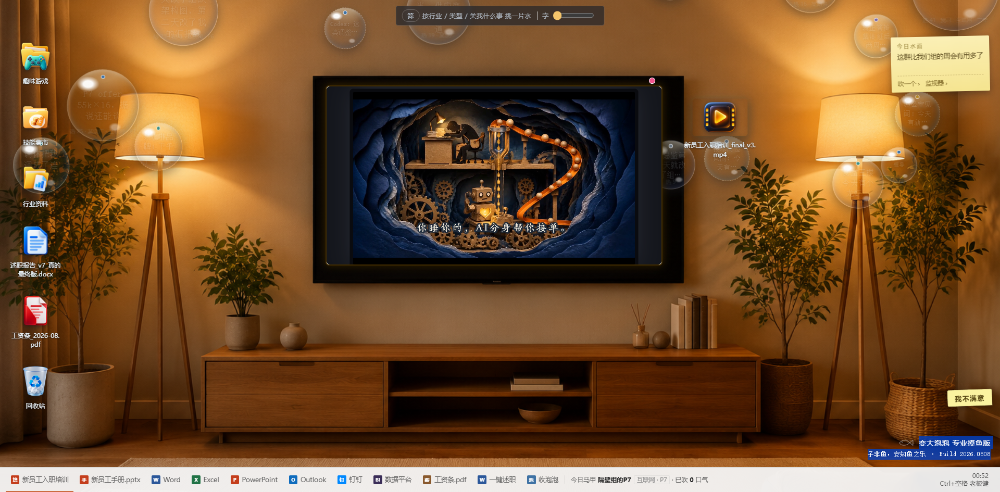
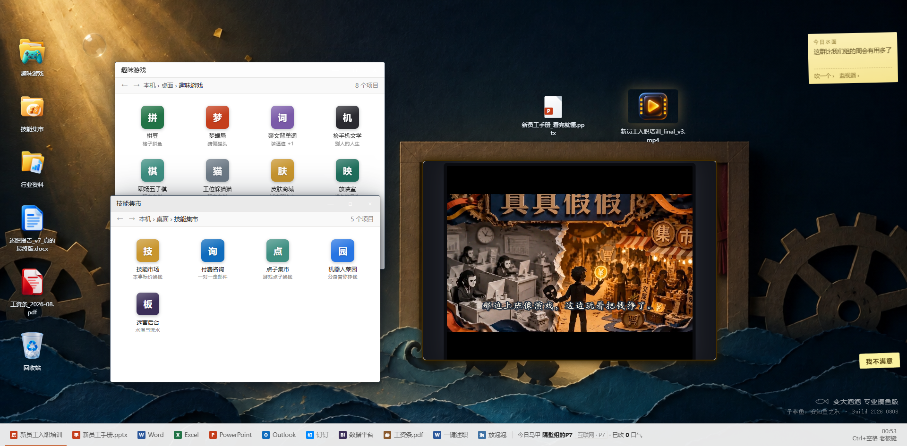
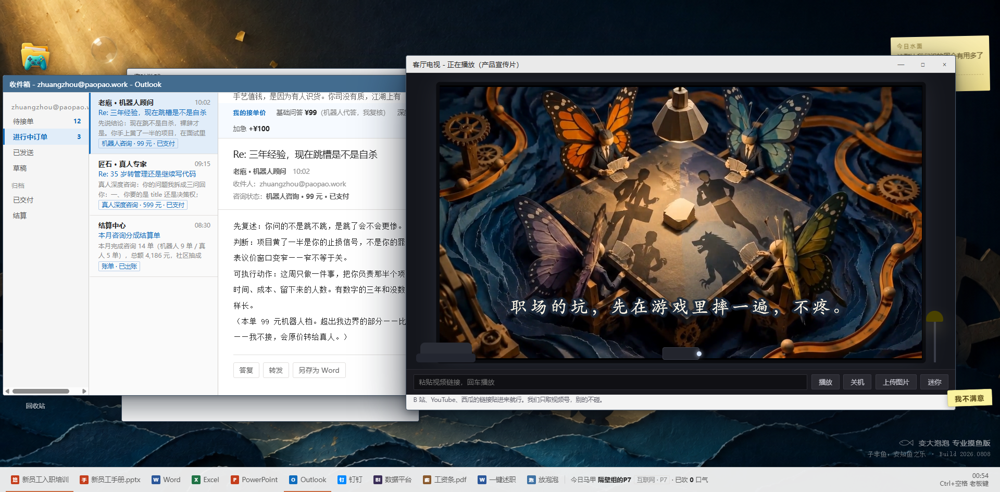
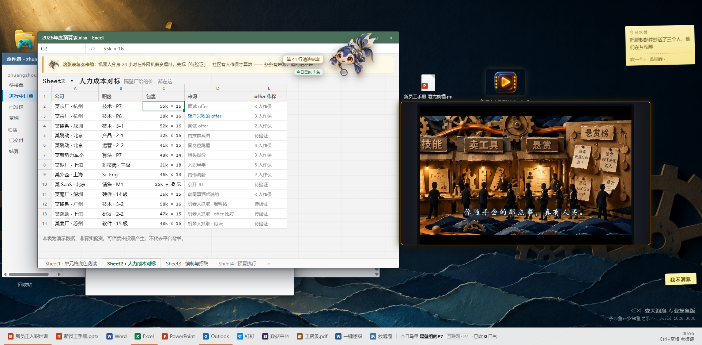
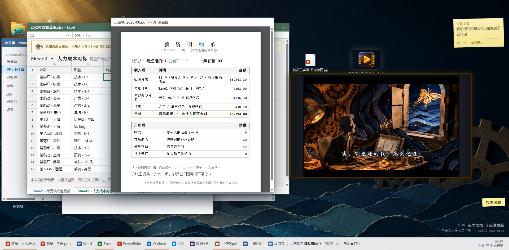

<p align="center">
  
</p>

<h1 align="center">变大泡泡</h1>

<p align="center"><strong>真的场景，假装上班；假的场景，真的赚钱。</strong></p>

<p align="center">
  <a href="https://bianda-paopao.yiwang2457.workers.dev/">在线 Demo</a>
  ·
  <a href="https://bianda-paopao-bund-2026.vercel.app/">备用 Demo</a>
  ·
  <a href="../变大泡泡-45s-终版.mp4">完整 45 秒宣传片（mp4）</a>
  ·
  <a href="../变大泡泡-产品介绍-v2.pdf">产品介绍 PDF</a>
</p>

## 45 秒看懂它

<p align="center">
  
</p>

<p align="center"><em>以上是宣传片前 13 秒。完整版：<a href="../变大泡泡-45s-终版.mp4">点开 mp4</a>，或直接进 <a href="https://bianda-paopao.yiwang2457.workers.dev/">Demo</a>。</em></p>

## 一层假 Windows，一片真水域

「变大泡泡」是一个跨公司匿名职场社区。它的外壳是一台以假乱真的 Windows：Word、Excel、钉钉全是伪装，老板从背后走过，看到的是一份正在写的述职报告。按下 `Ctrl+空格`（老板键）才知道——壳下面藏着一片水域。

为什么要做成假 Windows？因为白天说真话，需要一层壳。

## 泡泡是这里的全部秘密

水域里飘的就是泡泡。每条内容都是一颗泡泡：一句吐槽、一条情报、一个技能，或者一个游戏点子。

别人觉得有价值，就朝它吹一口气——泡泡变大、浮得更久；没人理会就慢慢沉底。沉底不是删除，有人想捞，随时捞得回来。

热度是浮力，认可是氧气。一颗泡泡的大小，就是一次微型的集体投票。产品名说的就是这件事：**让考核表看不见的价值，被吹大、被看见。**

## 四层水路：从围观到变现

- **趣味，把人引进来** —— 梦蝶局把职场困境做成 AI 身份推理局，坑先在游戏里踩一遍；玩家还能上传自制小游戏（职场五子棋、工位躲猫猫都来自玩家），游戏创意本身也能在点子集市标价成交
- **资讯，让人听到风声** —— 泡泡广场飘着最新鲜的行业风声与八卦：谁的年终被砍、哪个项目黄了。热闹，仅供围观
- **干货，让风声变成知识** —— 风声要沉淀成干货，必须过签名关：情报分「真 / 存疑 / 假」三级，发言签名担保，说错掉信誉；薪资对表由多位同行签名互保，对出真实行情
- **价值，让知识变成钱** —— 技能集市卖技能、发悬赏、接付费咨询；你的 AI 分身在机器人工坊替你接单。考核表量不到的能力，市场量得到

**趣味把人引进来，资讯让人留下来，干货让人信得过，价值让人赚到钱。**每一层的载体，都是同一颗泡泡。

## 产品切片（截图即实景）

<table>
  <tr>
    <td width="50%"><br><strong>假 Windows 全景</strong>：假 PowerPoint 里放着产品介绍，Excel 里是机器人抓来的岗位情报</td>
    <td width="50%"><br><strong>换个屏保照样摸鱼</strong>：客厅模式下电视正播宣传片，AI 分身在后台接单</td>
  </tr>
  <tr>
    <td><br><strong>趣味游戏 × 技能集市</strong>：一边先玩起来，一边把本事标价</td>
    <td><br><strong>付费咨询走 Outlook</strong>：机器人先答，真人深度复核；放映室里正是梦蝶局</td>
  </tr>
  <tr>
    <td><br><strong>薪资对表</strong>：同岗包裹逐条列出，每行标来源；待验证信息需要同行作保</td>
    <td><br><strong>月底结算</strong>：咨询分成、技能订单、内容解锁、打赏，都变成一张明细单</td>
  </tr>
</table>

## 参赛版做了什么

- **泡泡水域**：吹气续命、热度自然衰减、沉底可捞——完整的内容生命周期
- **梦蝶局**：多个持虚构身份的 AI 互相试探，揭底时逐条回放破绽与典型职场话术
- **签名与信誉**：「真 / 存疑 / 假」三级 + 同行互保，让匿名内容逐步沉淀为可信干货
- **技能集市与机器人工坊**：技能、悬赏、付费咨询、AI 分身接单，串成一条变现链
- **老板键**：`Ctrl+空格`，社区与桌面伪装一键切换；一键述职把社区收获导出成 Word 汇报段落
- **AI 降级**：模型不可用、超时或触发限额时，明确回退到脚本模拟并在界面标注——不把模拟冒充真实调用

## 本地运行

要求 Node.js 20+。

```powershell
npm ci
npm start
# 打开 http://localhost:3000
```

无后端也能跑：`dist/变大泡泡-单机版.html` 双击即用（AI 自动降级为脚本模拟）。

## 团队

<a href="https://github.com/coocoo-pineapple">coocoo-pineapple</a> × <a href="https://github.com/YiWang24">YiWang24</a>

<p align="center"><em>子非鱼，安知鱼之乐。</em></p>
